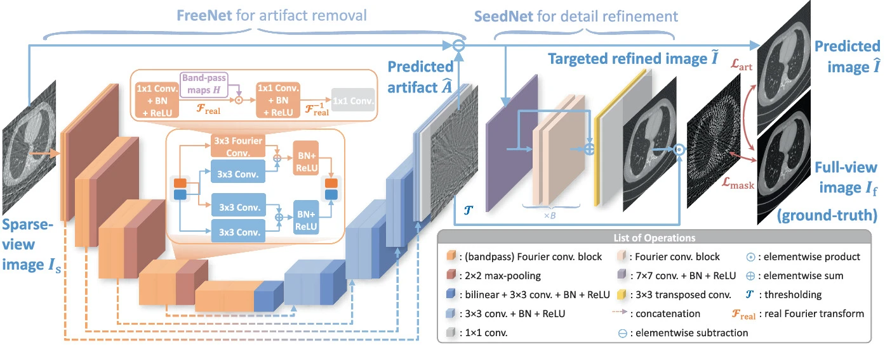

# FreeSeed: Frequency-band-aware and Self-guided Network for Sparse-view CT Reconstruction
This is the official implementation of the paper "FreeSeed: Frequency-band-aware and Self-guided Network for Sparse-view CT Reconstruction" [[arxiv](https://arxiv.org/abs/2307.05890), [springer](https://link.springer.com/chapter/10.1007/978-3-031-43999-5_24)].




## Data Preparation
The AAPM-Myo dataset can be downloaded from: [CT Clinical Innovation Center](https://ctcicblog.mayo.edu/2016-low-dose-ct-grand-challenge/)
(or the [box link](https://aapm.app.box.com/s/eaw4jddb53keg1bptavvvd1sf4x3pe9h/folder/144594475090)). Please see [here](https://github.com/Masaaki-75/freeseed/issues/4) for simple data preprocessing.


## Training & Inference
Please check `train.sh` for training script (or `test.sh` for inference script) once the data are well prepared. Please configure the dataset path and other settings in the script before running it.

We note that it is time-consuming to directly train sinogram-domain sub-network and image-domain sub-network of FreeSeed<sub>DUDO</sub> using a combination of loss functions simultaneously. A more efficient way, as in `dudo_trainer.py`, is to:
- First, warm up the image-domain FreeNet first with image-domain losses (pixel loss and SeedNet loss) for a few epochs;
- Then, jointly train the two sub-networks with dual-domain losses (pixel loss, sinogram loss, and Radon consistency loss) for the rest epochs.

## Requirements
```
- Linux Platform
- python==3.7.16
- torch==1.7.1+cu110  # depends on the CUDA version of your machine
- torchaudio==0.7.2
- torchvision==0.8.2+cu110
- torch-radon==1.0.0
- monai==1.0.1
- scipy==1.7.3
- einops==0.6.1
- opencv-python==4.7.0.72
- SimpleITK==2.2.1
- numpy==1.21.6
- pandas==1.3.5  # optional
- tensorboard==2.11.2  # optional
- wandb==0.15.2  # optional
- tqdm==4.65.0  # optional
```

## Other Notes
We choose [torch-radon toolbox](https://github.com/matteo-ronchetti/torch-radon/tree/master) to build our framework because it processes tomography really fast! For those who have problems installing torch-radon toolbox:
- There seems to be other forks of torch-radon like [this](https://github.com/faebstn96/torch-radon) that can be installed via `python setup.py install` without triggering too many compilation errors🤔.
- Check the [issues](https://github.com/matteo-ronchetti/torch-radon/issues) of torch-radon (both open & closed), since there is discussion about any possible errors you may encounter during installation.


## Citation
If you find our work and code helpful, please kindly cite the corresponding paper:
```bibtex
@InProceedings{ma2023freeseed,
    author={Ma, Chenglong and Li, Zilong and Zhang, Yi and Zhang, Junping and Shan, Hongming}, 
    title={{F}ree{S}eed: Frequency-band-aware and Self-guided Network for Sparse-view {CT} Reconstruction},
    booktitle={Medical Image Computing and Computer Assisted Intervention -- MICCAI 2023},
    year={2023},
    pages={250--259},
    doi={10.1007/978-3-031-43999-5_24}
}
```
